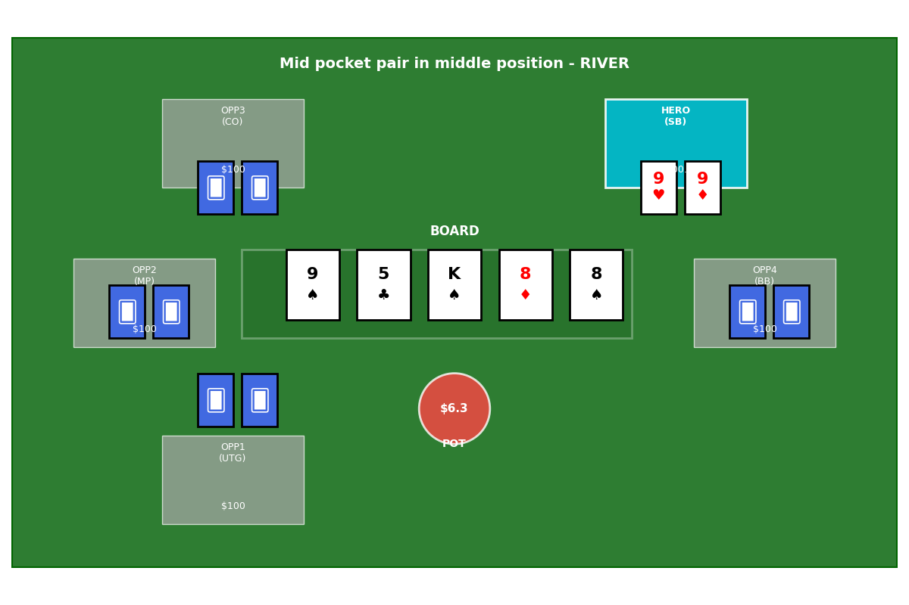

# AG2 Poker Assistant

Interactive poker simulator with AI agents powered by AG2/AutoGen framework for multi-agent strategic discussions.

## What It Does

This is an **interactive poker simulator** that provides strategic advice through specialized AI agents. It creates a command-line poker game where you can deal hands, make decisions, and get real-time strategy recommendations from four different AI poker experts working together.

## Task-Based Quick Start

### 🚀 Setup Tasks

```bash
# Task 1: Install dependencies
pip install -r requirements.txt

# Task 2: Install AG2 framework
pip install ag2

# Task 3: Start Ollama (local AI)
ollama serve
ollama pull llama3.2:latest

# Task 4: Run simulator
python3 interactive_poker_simulator.py
```

### 🎯 Essential Commands

Once running, use these commands:
- `agents` - Check agent status and setup diagnostics
- `new` - Deal a new poker hand
- `discuss "question"` - Start multi-agent discussion
- `help` - View all available commands

## Core Architecture

### 🤖 Four Specialized AI Agents
- **RulesAgent**: Validates legal moves and game mechanics
- **MathAgent**: Calculates pot odds, equity, and probability
- **PositionAgent**: Analyzes table position and range strategy
- **JonathanAgent**: Applies Jonathan Little's tournament strategy (with RAG)

### 🎮 Interactive Game Loop
```
Deal Hand → Get Agent Advice → Make Decision → See Results → Repeat
```

### 🧠 Knowledge System
- **RAG Integration**: Scrapes real poker training episodes from Jonathan Little's site
- **ChromaDB**: Vector database storing poker strategies and hand analyses
- **Contextual Advice**: Agents reference actual poker content for recommendations

## Task-Based Workflow

### Task 1: System Initialization
```bash
# Check agent setup status
agents

# Expected output if setup needed:
# ❌ Agents: Not initialized - AG2/AutoGen required
# 📋 Requirements for real agents:
#    • AG2/AutoGen installed: pip install ag2
#    • Ollama running on localhost:11434
#    • llama3.2:latest model downloaded
```

### Task 2: Deal Your First Hand
```bash
# Start a poker session
new

# Expected output if agents working:
# 📊 HAND #1
# Position: BTN, Hole Cards: Ah Ks
# 🤖 AGENT RECOMMENDATIONS:
# [Multi-agent analysis and recommendations]
```

### Task 3: Get Strategic Advice
```bash
# Ask agents to discuss strategy
discuss "Should I bet for value or check?"

# Expected output:
# 💬 MULTI-AGENT DISCUSSION:
# [Real-time conversation between agents]
# [Consensus recommendation with reasoning]
```

### Task 4: Make Decisions
```bash
# Take poker actions based on advice
raise 25    # or fold, call, check
bet 10      # specify bet amounts

# System simulates outcomes and updates stack
```

## Command Reference

### 🎮 Game Commands
```bash
new              # Deal new hand
fold             # Fold current hand
call             # Call the bet
check            # Check (no bet)
bet 25           # Bet $25
raise 50         # Raise to $50
```

### 🤖 Agent Commands
```bash
discuss "question"    # Start multi-agent discussion
agents               # Check agent status and diagnostics
```

### 📊 Session Commands
```bash
stats            # View session statistics
reset            # Reset stack and start over
help             # Show all commands
quit             # Exit simulator
```

## Development Tasks

### 📚 Task-Based Learning Path

#### Task Set 1: Quick Start (10 minutes)
- [ ] **Task**: Read this README.md for project overview
- [ ] **Task**: Install dependencies from `requirements.txt`
- [ ] **Task**: Run `python3 interactive_poker_simulator.py`
- [ ] **Task**: Use `agents` command to check setup status

#### Task Set 2: Understanding Agents (20 minutes)
- [ ] **Task**: Read `agents/base_agent.py` for agent framework
- [ ] **Task**: Study `agents/math_agent.py` for specialist example
- [ ] **Task**: Compare different agent approaches in other agent files
- [ ] **Task**: Run `discuss "test question"` to see agent interactions

#### Task Set 3: Game Mechanics (15 minutes)
- [ ] **Task**: Explore `game/poker_engine.py` for hand generation
- [ ] **Task**: Use `new` command multiple times to see different scenarios
- [ ] **Task**: Test `fold`, `call`, `raise` actions to see outcomes

#### Task Set 4: Knowledge System (20 minutes)
- [ ] **Task**: Examine `knowledge/knowledge_base.py` for RAG implementation
- [ ] **Task**: Check `knowledge/wph_scraper.py` for data collection
- [ ] **Task**: Review scraped data files in `/data` directory

#### Task Set 5: Visualization (10 minutes)
- [ ] **Task**: Study `visualization/table_view.py` for poker table graphics
- [ ] **Task**: Deal hands and observe the visual table updates



### 🔍 Key Code Patterns

#### Agent Pattern
```python
class SpecialistAgent(BaseAgent):
    def __init__(self, llm_config):
        self.specialty = "specific domain"

    def get_recommendation(self, game_state):
        # Analyze situation
        # Return structured advice
```

#### Multi-Agent Discussion Pattern
```python
# Real GroupChatManager usage for agent conversations
chat_result = self.agents[0].initiate_chat(
    recipient=self.chat_manager,
    message=context,
    max_turns=8,
    silent=False
)
```

## Project Structure

```
poker-assistant-ag2/
├── agents/                    # AI agent implementations (4 specialists)
│   ├── base_agent.py         # Base agent class (3.2K)
│   ├── jonathan_agent.py     # Jonathan Little strategy (8.8K)
│   ├── math_agent.py         # Mathematical analysis (10K)
│   ├── position_agent.py     # Position strategy (9.8K)
│   └── rules_agent.py        # Game rules validation (5.9K)
├── game/
│   └── poker_engine.py       # Simplified poker engine (12K)
├── knowledge/
│   ├── knowledge_base.py     # RAG knowledge base (17K)
│   └── wph_scraper.py        # WPH episode scraper (17K)
├── setup/
│   └── knowledge_base_setup.py  # KB initialization (9K)
├── visualization/
│   └── table_view.py         # Poker table graphics (14K)
├── interactive_poker_simulator.py  # Main CLI app (18K)
├── requirements.txt          # Dependencies
└── README.md                # This guide
```

## Technical Stack

- **AG2/AutoGen**: Multi-agent conversation framework
- **Ollama**: Local LLM (llama3.2) - no API keys needed
- **ChromaDB**: Vector database for poker knowledge
- **Matplotlib**: Real-time poker table visualization
- **BeautifulSoup**: Web scraping for training content
- **Sentence Transformers**: Text embeddings for RAG

